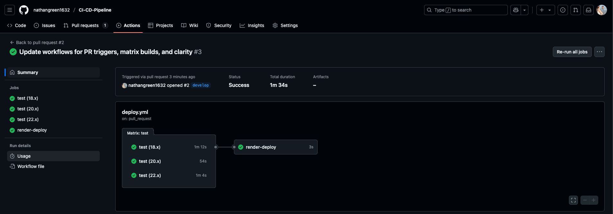
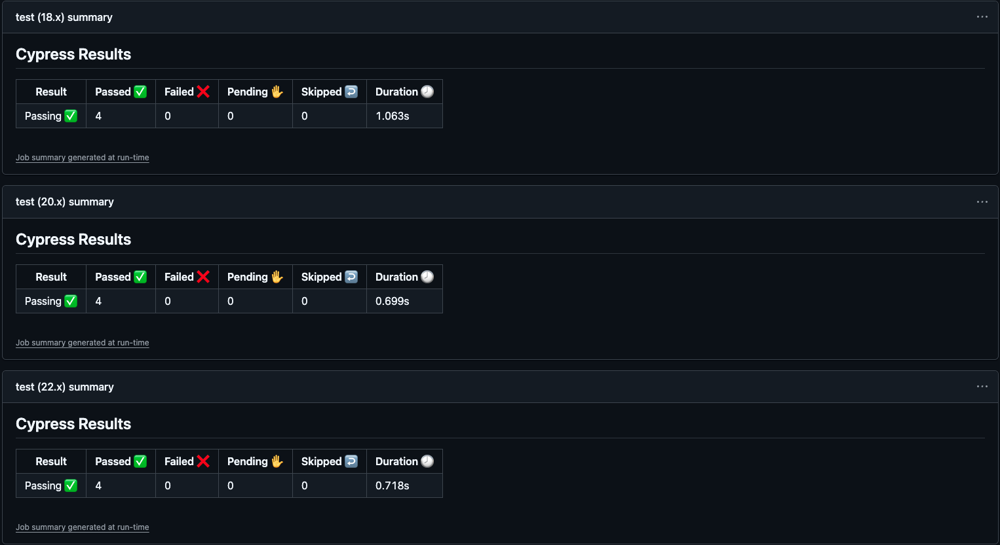
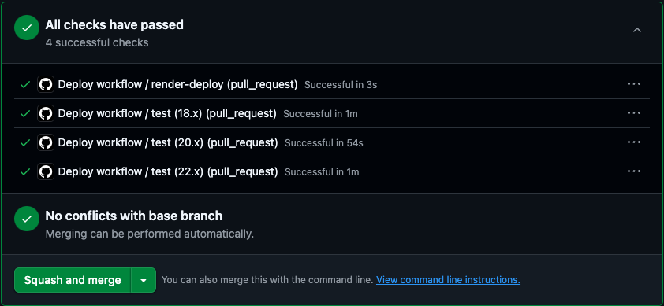

# CI/CD Pipeline — Full-Stack Application

Welcome to the **CI/CD Pipeline** repository. This full-stack project implements continuous integration and continuous deployment using **GitHub Actions**, **Cypress** testing, and **Render.com** hosting.

---

## Project Purpose

This application automates testing and deployment for a full-stack app using a structured Git branching model. The goals are:

- Run **Cypress component tests** on pull requests to the `develop` branch
- Automatically deploy to **Render** when `develop` is merged into `main`

---

## Technologies Used

- **React** (Vite + TypeScript)
- **Node.js + Express** (Backend)
- **MongoDB** (Database)
- **Cypress** (Component Testing)
- **GitHub Actions** (CI/CD)
- **Render.com** (Deployment Platform)

---

## How CI/CD Works

### When You Open a Pull Request to `develop`:
- A GitHub Action triggers automatically
- Cypress component tests run in a headless browser
- Test results are shown directly in the PR

### When You Merge `develop` into `main`:
- A second GitHub Action triggers
- The app is deployed to Render using a **Deploy Hook**
- You get **zero-downtime deployment** to production

---

## Cypress Testing

Component tests are located in the `cypress/component/` directory and are configured to run automatically in CI.

**Example coverage:**
- `Quiz.cy.jsx`: Tests the quiz component's behavior and answer logic
- `Hello.cy.tsx`: Verifies component rendering and state updates

Tests are configured in `cypress.config.ts` and bootstrapped with **Vite** for fast test execution.

---

## GitHub Actions Workflows

Two workflows are configured inside `.github/workflows/`:

- `main.yml`: Runs Cypress component tests on PRs to `develop`
- `deploy.yml`: Deploys to Render when `main` is updated

Both workflows:
- Use Node.js setup
- Implement dependency caching
- Are built for fast performance

---

## How to Use This Repo

1. Clone the repository
2. Create a `develop` branch for new features
3. Open pull requests targeting `develop`
4. Check GitHub Actions to confirm tests pass
5. Merge `develop` into `main` only when tests are green
6. Render deploys automatically via the deploy hook URL

---

## Render Deployment Setup

To configure deployment:

1. Deploy the app manually on Render
2. Go to Render dashboard → **Settings → Deploy Hooks**
3. Turn off **Auto-Deploy**
4. Copy your **Deploy Hook URL**
5. Add the hook URL to your GitHub Actions **Secrets**
6. GitHub will POST to that URL when `main` is updated

---

## Acceptance Criteria Checklist

- PRs to `develop` run Cypress component tests via GitHub Actions
- Cypress tests must pass before merging
- Code merged to `main` automatically deploys to Render
- Application live URL works with no console errors
- GitHub repo includes `main`, `develop`, and `feature/*` branches
- README contains full project description and instructions

---

## Naming Conventions

- **Branch names**: `feature/your-feature-name`
- **Commit messages**: `(task: action) commit message`

**Example:**  
`(test: add) added Cypress test for Quiz component`

---

## Render.com Link

- [Live Application on Render](https://ci-cd-pipeline-q88d.onrender.com/)

---

## GitHub Gist
- [GitHub Gist for CI/CD Pipeline](https://gist.github.com/nathangreen1632/7e9b705fcd4709c64728ef2fe30c94f5)

---

## Screenshots

---

## Development Notes

- **Frontend**: React, Vite, Tailwind (optional)
- **Backend**: Express, Sequelize ORM, PostgreSQL
- **Testing**: Cypress uses `component-index.html` for isolated rendering
- **Seed data**: Located in `server/src/seeds/`

---

## 📄 License

This project is open source and available under the **MIT License**.
